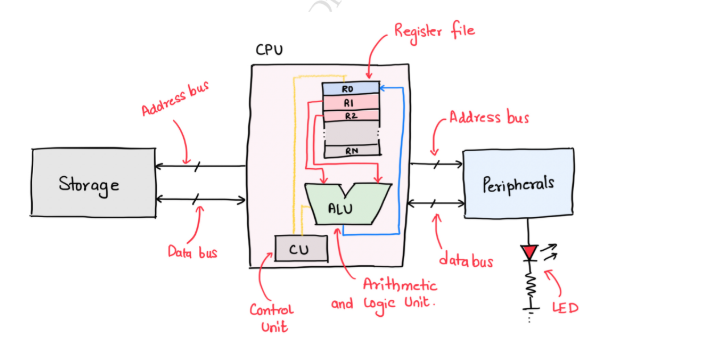
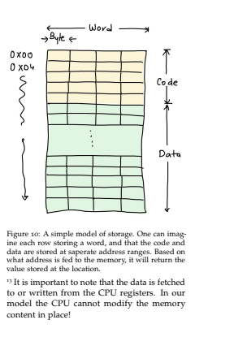
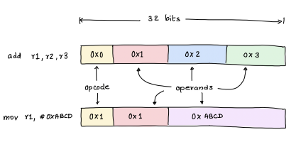

# Modelo de sistema de cómputo

Para programar en C, debes tener presentes la CPU, la memoria y cómo la CPU maneja los periféricos. C se creó para facilitar la vida del programador: en la década de 1970 era común programar directamente en ensamblador y era difícil; con C eso dejó de ser necesario en la mayoría de los casos.

Nota: Un truco para entender mejor C: en C, cada declaración suele representar una operación aritmética, un movimiento de datos o una operación de memoria. Tan simple como eso.

## Modelo load-store

Un modelo simple de computación es el de una CPU conectada a algún sistema de almacenamiento, con la capacidad de enviar y recibir instrucciones y datos, Algo como la siguiente imagen.

 

 

Vemos multiples elementos:
- CPU
    - Register
    - ALU
    - CU
- Storage
- Peripheral

Dentro de la CPU (unidad central de procesamiento) existe un conjunto de registros (memorias temporales) que funciona como almacenamiento temporal sobre el que la CPU puede realizar operaciones como:
- sumar
- restar
- dividir
- comparar
- entre muchas otras

La CPU manipula los datos almacenados en los registros. Sin embargo, los datos deben transferirse entre los registros y la memoria a través de los buses. Para lograrlo, la CPU presenta la dirección deseada por en el bus de direcciones (address bus) y lee o escribe datos por el bus de datos (data bus). Cuando los datos se transfieren desde la memoria a un registro, se denomina operación de “carga” (load); cuando se mueven de un registro a la memoria, se denomina “almacenamiento” o “guardar” (store).

Algo interesante del diagrama es que el periférico (por ejemplo, un LED) se trata como si fuera memoria. Esto significa que podemos leer y escribir en su dirección correspondiente, lo que permite interactuar con el mundo real directamente desde la CPU; por ejemplo, el LED podría encenderse cuando se escribe cierto valor en su dirección de memoria.

## Almacenamiento, datos e instrucciones

La memoria es un componente fundamental de un sistema de cómputo y opera a nivel de bits. Cada bit se implementa con elementos eléctricos que representan presencia o ausencia de carga. Esta distinción se traduce al sistema binario: la presencia de carga corresponde a “1” (encendido) y su ausencia a “0” (apagado). Con 8 bits formamos un byte y, con 4 bytes combinados, una palabra.

La CPU interactúa con la memoria en bloques; no accede a bits individuales. Puede leer o escribir datos en unidades de 1, 2 o 4 bytes, dependiendo de la arquitectura. Aunque el contenido almacenado es, en esencia, una colección de bits, la forma en que la CPU interpreta esos bits distingue entre dos conceptos cruciales: datos e instrucciones.

Durante la ejecucion de instrucciones como (load) o (store), la CPU emplea el (address bus) para transmitir un valor (una representacion numerica) que corresponde a una direccion en la region de la memoria de datos (Data memory), simultaneamente, el (Data bus) establece una conexion con el Registro de archivo, habilitando la transferencia de datos.

Cuando la CPU no esta realizando operaciones como (load) o (store), el bus de direcciones (address bus) lleva un valor que corresponde a un codigo en la direccion de memoria. En este escenario, el valor presentado sobre el (Data Bus) es interpretado por la CPU como una instruccion, iniciando la ejecucion de una especifica operacion o multiples operaciones.

Esa es la principal diferencia entre los datos y las operaciones de CPU.

## Instrucciones

CPUs modernas utilizan instrucciones que son de 32bits o 4 bytes de ancho. Esas instrucciones son compuestas de diferentes combinaciones de estados (on/off).

**Ejemplo**

Estos 32 bits (8 bit cada cuadro) pueden ser organizados para representar una operacion como la suma de dos registros o mover un valor del registro.

La CPU puede determinar que operacion es requerida examinando la seccion conocida como OPCODE (Los cuadros amarillos). El OPCODE tiene 7 bits de ancho y abarca desde el bit 31 hasta el bit 25.

El valor que tenga el OPCODE siempre correspondera a una operacion. En la imagen por ejemplo el OPCODE 0x0 denota la operacion "add" mientras que el 0x1 significa una operacion de "move", los demas parametros (Los cuadros que no son amarillos) son conocidos como operando (operand).

Hasta aca termina la seccion de Modelo de sistema, el cual se exploro a nivel superificial.

