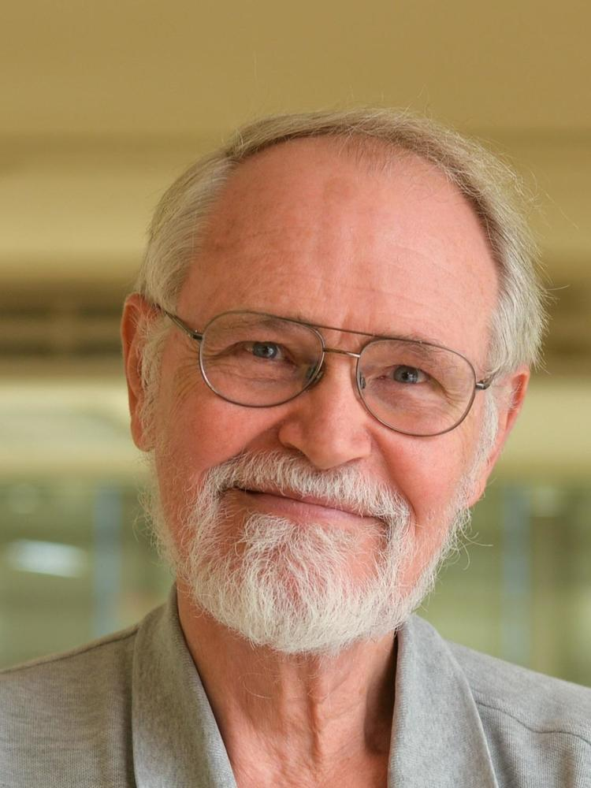

# Orígenes de C

C fue desarrollado por Dennis Ritchie en los Laboratorios Bell entre 1972 y 1973, como sucesor del lenguaje de programación B; de ahí su nombre: C. Heredó conceptos fundamentales y parte de la sintaxis de B y BCPL, con el objetivo de ofrecer un alto nivel de abstracción y, sobre todo, portabilidad.

El lenguaje se diseñó con la simplicidad en mente y con una biblioteca estándar relativamente pequeña. Su portabilidad permitió escribir programas que podían trasladarse con relativa facilidad a diferentes tipos de hardware y seguir funcionando.

En 1978, Brian W. Kernighan y Dennis M. Ritchie publicaron la primera edición de “The C Programming Language”, también conocido como “K&R”. Durante muchos años, este libro funcionó como la especificación informal del lenguaje.

Una de las fortalezas de C es que no oculta los detalles del hardware al programador. Cada desarrollador puede entender con precisión cómo su software interactúa con la memoria y la CPU, lo que proporciona un alto grado de control. Sin embargo, los programadores novatos deben comprender bien la gestión de memoria y el modelo de ejecución; de lo contrario, sus programas podrían estar mal optimizados o presentar errores sutiles.

- Extensiones: `.c`, `.h`
- Paradigma: imperativo (procedimental) y estructurado
- Tipado: estático, débil
- Implementaciones: GCC, Clang, Intel C, etc.

## Línea de tiempo del lenguaje C

| Año | Nombre informal | Estándar oficial |
| --- | --- | --- |
| 1972 | Primera versión | — |
| 1978 | K&R C | — |
| 1989/1990 | ANSI C, C89, ISO C, C90 | ANSI X3.159-1989 / ISO/IEC 9899:1990 |
| 1999 | C99, C9X | ISO/IEC 9899:1999 |
| 2011 | C11, C1X | ISO/IEC 9899:2011 |
| 2018 | C17, C18 | ISO/IEC 9899:2018 |
| 2024 | C23, C2X | ISO/IEC 9899:2024 |
| TBA | C2Y | — |

Esta pagina no pretende ser una biografia de todo C ni de sus creadores, solo es una pequeña prueba y punto de referencia personales, se que no he nombrado a muchas otras personas como Ken Thompson sin su trabajo no hubieramos visto UNIX ni BLang.

## Referencias

- [Computer Museum Video](https://www.youtube.com/@ComputerHistory)
- [Interview Brian Kernighan](https://www.youtube.com/watch?v=de2Hsvxaf8M&t=3s&pp=ygUJQyBoaXN0b3J5)

 

## Imagenes

A la izquierda tenemos a Denis ritchie (Creador de C) y a su derecha Brian Kerninghan (Uno de los creadores de UNIX)

Brian aun esta vivo (fecha de este post 11-13-2025) se encuentra trabajando como cientifico en la universidad de Princeton; Por otra parte Dennis Ritchie fallecio a los 70 años, el 12 de octubre de 2011.

